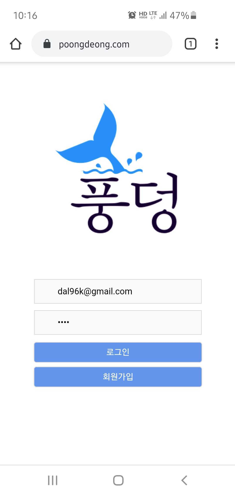
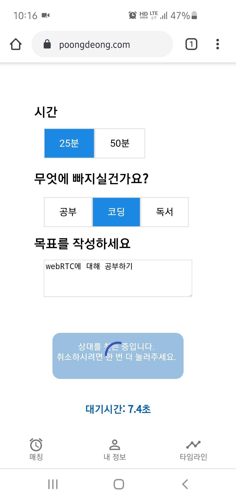
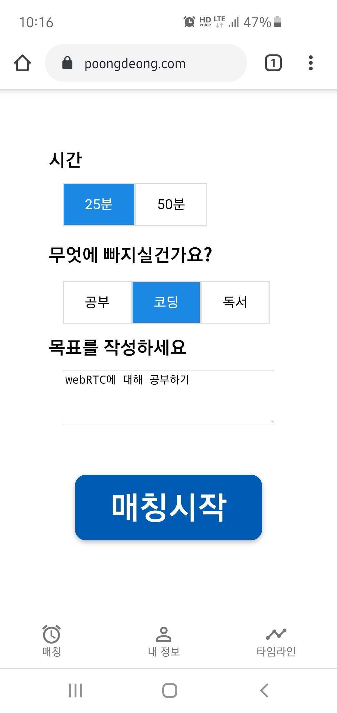
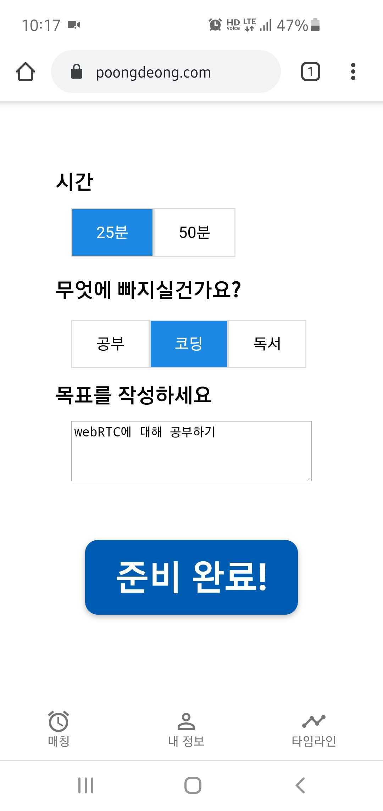
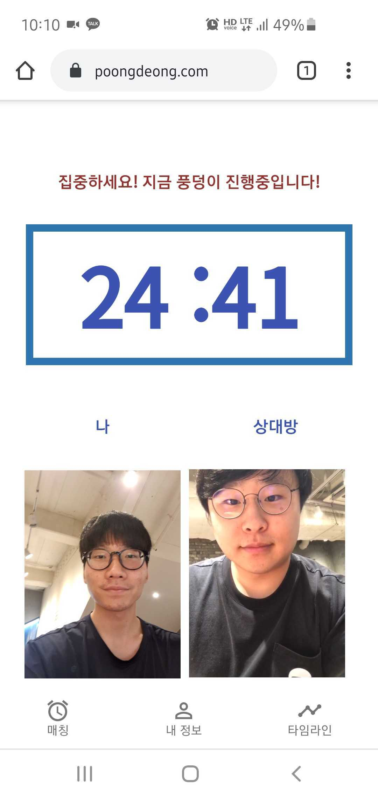
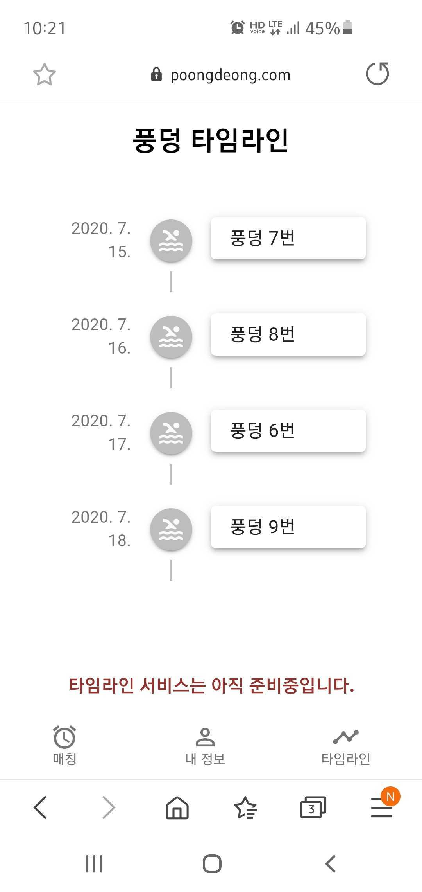
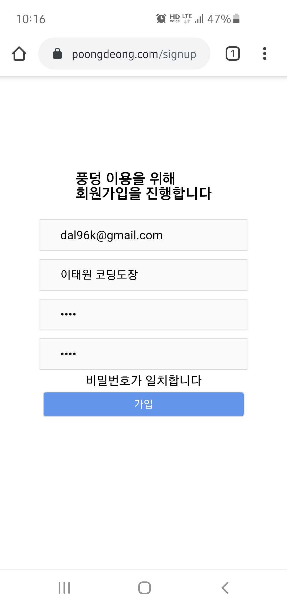
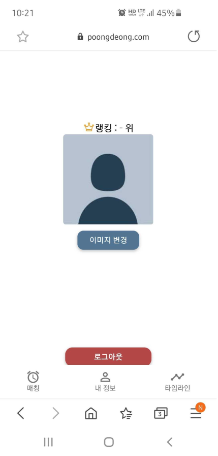

## 풍덩

웹 사이트 URL : https://poongdeong.com/

<br />

## 프로젝트 소개

코로나로 인해 대부분의 공공 도서관과 학교 도서관이 문을 닫아 집에서 혼자 공부해야하는 학생들이 많아지고있습니다. 혼자 공부하다보면 집중력이 떨어지게 되고, 딴짓도 많이 하게됩니다. 그러다보면 공부에 대한 의욕도 사라지고 해야할 공부는 쌓여만 갑니다.
이를 해결하기 위해 온라인으로도 혼자 깊게 집중할 수 있는 상황을 만들어 주고, 공부를 지속할수록 성취감을 느낄 수 있게 하기 위해 프로젝트 제작했습니다.

<br />

## 프로젝트 실행 방법

```javascript
$ git clone https://github.com/PoongDeong/poongdeong.git

$ cd client
$ npm install
$ npm start

$ cd server
$ npm install
$ npm start
```

Api ([README here](https://github.com/PoongDeong/poongdeong))

<br />

## 테스트

``` javascript
$ npm test
```
<br />

## 웹 사이트 화면


|                 홈                |               매칭화면                |
| :-----------------------------------: | :-----------------------------------: |
|     |    |

|               매칭시작                |                준비완료               |
| :-----------------------------------: | :-----------------------------------: |
|  |   |

|                공부시작               |               타임라인             |
| :-----------------------------------: | :-----------------------------------: |
|  |  |

|               로그인               |                 내정보                |
| :-----------------------------------: | :-----------------------------------: |
|  |  |

<br />


## 구현한 기능

- 로그인, 로그아웃
- 회원가입
- 옵션이 같은 사람과 스터디 매칭
- 매칭시 영상을 통해 상대방의 공부하는 모습을 확인 가능
- 공부 타이머
- 프로필 등록

<br />

## 사용 기술

| **FrontEnd** |                |
| ---------------- | -------------- |
| **ReactJS**      | UI 라이브러리  |
| **React-Router** | 라우팅         |
| **Webpack**      | 번들링         |
| **axios**        | API 요청       |
| **Redux**        | 상태관리       |
| **WebRTC**       | 화상채팅       |
| **Emotion**      | 스타일링       |
<br />

| **BackEnd**      |                |
| ---------------- | -------------- |
| **Express**      | API 라이브러리  |
| **MariaDB**      | DataBase       |
| **Nginx**        | 웹서버          | 
| **Terraform**    | 인프라          |
| **Socket.io**    | 실시간 연결     |
<br />

| **Test**         |                  |
| ---------------- | ---------------- |
| **Jest**         | Unit test        |
| **Supertest**    | Integration test |
| **react testing library**| React component test |
